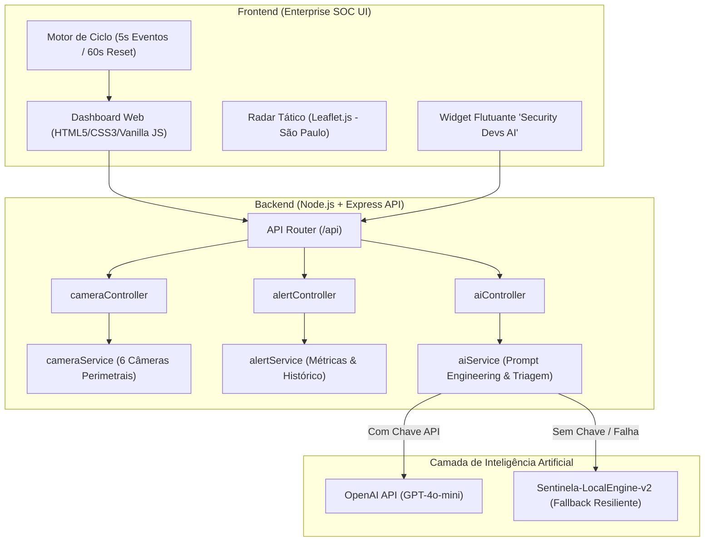

# 🛡️ SECURITY DEVS // Condominium Defense & Threat Monitoring SOC

> **Plataforma Inteligente de Monitoramento Perimetral, Diagnóstico de Dispositivos e Triagem de Ameaças com IA Generativa**


[](https://github.com/VictorGoiz)

---

## 🎓 Contexto Acadêmico & Estudo de Caso (SENAI)

Este projeto foi desenvolvido como **atividade prática de estudo de caso (Case Study)** no curso de **Inteligência Artificial Generativa do SENAI** (*Serviço Nacional de Aprendizagem Industrial*).

### 🎯 O Desafio Proposto
Desenvolver uma solução tecnológica integrada para resolver o problema crítico de **monitoramento de câmeras de segurança, gestão de falhas, erros de dispositivos e triagem de falsos positivos** em ambientes condominiais e corporativos.

### 💡 A Abordagem com IA Generativa
Sistemas tradicionais de Circuito Fechado de TV (CFTV) e sensores infravermelhos geram elevado número de falsos alarmes (fadiga de alarmes), além de apresentarem mensagens de erro crípticas e baixa inteligência contextual. A integração de **Inteligência Artificial Generativa (LLMs)** e heurísticas especializadas permitiu:
1. **Triagem Contextual em Linguagem Natural:** Explicar ao operador e aos moradores de forma clara e empática por que determinado evento foi classificado como falso positivo (ex.: gato no muro ou folhagem ao vento) ou como ameaça real.
2. **Diagnóstico Inteligente de Dispositivos:** Avaliar o status das câmeras, integridade do sinal, oscilações térmicas e calibração de sensores perimetrais.
3. **Redução de Pânico e Fadiga Operacional:** Garantir que notificações sonoras e alertas críticos só cheguem aos moradores e guarita quando houver real perigo de intrusão humana.

---

## 📌 Sumário

- [Visão Geral e Problemática](#-visão-geral-e-problemática)
- [Arquitetura da Solução](#-arquitetura-da-solução)
- [Principais Funcionalidades](#-principais-funcionalidades)
- [Stack Tecnológica](#-stack-tecnológica)
- [Estrutura de Pastas](#-estrutura-de-pastas)
- [Documentação dos Endpoints (API REST)](#-documentação-dos-endpoints-api-rest)
- [Como Instalar e Executar](#-como-instalar-e-executar)
- [Ciclos de Teste e Simulações](#-ciclos-de-teste-e-simulações)
- [Papel da IA Generativa e Heurística Resiliente](#-papel-da-ia-generativa-e-heurística-resiliente)
- [Licença e Créditos](#-licença-e-créditos)

---

## 🔍 Visão Geral e Problemática

### O Problema do Mundo Real
Em condomínios residenciais e complexos comerciais, as equipes de portaria e segurança enfrentam diariamente:
- **Disparos Acidentais (Falsos Positivos):** Animais de pequeno porte (gatos, pássaros), galhos balançando com vento, sombras dinâmicas de postes e reflexos de faróis acionam sirenes no meio da madrugada.
- **Fadiga de Alarmes:** Devido ao excesso de avisos falsos, os operadores tendem a desativar ou ignorar notificações, criando brechas para invasores reais.
- **Insegurança dos Moradores:** Falta de clareza imediata sobre o que gerou um alerta causa pânico em grupos de comunicação condominiais.
- **Erros e Desalinhamento de Dispositivos:** Dificuldade em identificar rapidamente câmeras fora do ar, obstruídas ou descalibradas.

### A Solução "Security Devs SOC"
Uma plataforma tipo **SOC (Security Operations Center)** que combina:
- Dashboard de telemetria em tempo real com tema escuro profissional;
- Radar tático georreferenciado via Leaflet (São Paulo - SP);
- Mecanismo de ciclo contínuo de eventos a cada 5 segundos com auto-restauração a cada 60 segundos;
- Botão de simulação rápida de cenários (Gato, Vento/Folhas, Invasor Real);
- Agente conversacional inteligente (**Security Devs AI**) alimentado por OpenAI GPT-4o-mini ou motor local heurístico resiliente.

---

## 🏛️ Arquitetura da Solução



---

## ✨ Principais Funcionalidades

### 1. Radar Tático Georreferenciado (Leaflet.js)
- Visualização de mapa do condomínio localizado na região central de São Paulo (Jardins / Bela Vista).
- Polígono que delimita a cerca perimetral e área de cobertura.
- Marcadores interativos de cada câmera (`CAM-01` a `CAM-06`) com status dinâmico (Online, Filtrado ou Alerta Crítico).
- Seleção rápida de câmera (*Quick Jump*) com efeito *fly-to* suave e abertura de pop-up técnico com coordenadas GPS e resolução.

### 2. Motor de Ciclo Contínuo (5s / 60s)
- **A cada 5 segundos:** Injeta um cenário automatizado de evento (gato no muro leste, vento oscilando árvores, acesso de morador por biometria, tentativa real de invasão por escalada, reflexo de faróis, etc.).
- **A cada 60 segundos (1 minuto):** Realiza a restauração completa de todas as câmeras para o estado base seguro e recalibrado.
- Controles no painel para pausar/retomar o ciclo e forçar restauração a qualquer momento.

### 3. Classificação e Assertividade de Ameaças
O sistema classifica e trata cada evento detectado:
| Classificação | Categoria | Perigo Real? | Notifica Moradores? | Ação Tomada |
| :--- | :--- | :---: | :---: | :--- |
| `FALSE_POSITIVE_ANIMAL` | Gato no Muro | ❌ Não | ❌ Não | Alarme silenciado preventivamente; registro em log |
| `FALSE_POSITIVE_ENVIRONMENT` | Vento / Folhas | ❌ Não | ❌ Não | Filtro espectral descarta calor biológico; sem alarme |
| `AUTHORIZED_ACCESS` | Acesso Morador | ❌ Não | ❌ Não | Reconhecimento facial / LPR veicular liberado |
| `CRITICAL_INTRUDER` | Invasor Humano | ✅ **SIM** | ✅ **SIM** | Sirene, alerta à guarita, travas e push de perigo |
| `NORMAL_MONITORING` | Calibração | ❌ Não | ❌ Não | Telemetria e varredura rotineira |

### 4. Assistente Conversacional "Security Devs AI"
- Widget flutuante integrado ao SOC com contador de notificações de alertas críticos.
- Botões de atalho rápido (*Quick Prompts*) para dúvidas frequentes.
- Capacidade de responder dúvidas sobre câmeras específicas clicando em *"Consultar IA"* no card de cada dispositivo.
- Contextualizado com as métricas do turno e alertas recentes do condomínio.

### 5. Auditoria e Telemetria de Dispositivos
- Registro das últimas 20 ocorrências com horário, câmera, motivo técnico e status de notificação.
- Cards das câmeras com retículo digital simulado (*bounding boxes* com nível de confiança em porcentagem).
- Indicação técnica de resolução (4K, 1440p, 1080p), framerate (FPS), visão noturna e zona física instalada.

---

## 💻 Stack Tecnológica

| Camada | Tecnologia | Detalhes |
| :--- | :--- | :--- |
| **Frontend** | HTML5 Semântico, CSS3 Moderno, Vanilla JavaScript | Sem frameworks pesados; rápida inicialização e alta fidelidade visual estilo SOC militar/enterprise. |
| **Estilos & UI** | Flexbox, CSS Grid, Custom Properties, Animações | Fontes Google (*Inter* e *JetBrains Mono*), FontAwesome 6.5.1 para iconografia de segurança. |
| **Mapeamento** | [Leaflet.js](https://leafletjs.com/) v1.9.4 & CartoDB Dark Matter | Mapas interativos, polígonos perimetrais e marcadores customizados em tema escuro. |
| **Backend Runtime** | [Node.js](https://nodejs.org/) (v18+ recomendado) | Configurado nativamente como ES Modules (`"type": "module"`). |
| **Framework Web** | [Express](https://expressjs.com/) v5.2.1 | API REST estruturada em *Routes*, *Controllers* e *Services*. |
| **Integração de IA** | [OpenAI Node SDK](https://github.com/openai/openai-node) v4.85.4 | Suporte nativo ao modelo `gpt-4o-mini` com fallback para heurística local. |
| **Segurança & Config** | `cors` & `dotenv` | Controle de acesso a recursos entre origens e carregamento seguro de variáveis de ambiente. |

---

## 📁 Estrutura de Pastas

```text
sistema_seguranca_monit/
├── README.md                      # Documentação do projeto (este arquivo)
├── backend/                       # Servidor Node.js / Express
│   └── src/
│       ├── config/
│       │   ├── env.js             # Leitura centralizada de variáveis (.env)
│       │   └── openai.js          # Instanciação do cliente OpenAI
│       ├── controllers/
│       │   ├── aiController.js    # Controladores das rotas de chat e análise de ameaça
│       │   ├── alertController.js # Controladores de listagem, métricas e simulações
│       │   └── cameraController.js# Controladores de consulta às câmeras
│       ├── routes/
│       │   ├── aiRoutes.js        # Definição dos endpoints /api/ai
│       │   ├── alertRoutes.js     # Definição dos endpoints /api/alerts
│       │   ├── cameraRoutes.js    # Definição dos endpoints /api/cameras
│       │   └── index.js           # Agrupador de rotas e endpoint /api/health
│       ├── services/
│       │   ├── aiService.js       # Orquestração de prompts, chamadas à OpenAI e motor local
│       │   ├── alertService.js    # Lógica de simulação, métricas e histórico de alertas
│       │   └── cameraService.js   # Catálogo e alteração de status das câmeras
│       ├── .env                   # Variáveis de ambiente (PORT, OPENAI_API_KEY, OPENAI_MODEL)
│       ├── app.js                 # Configuração do Express, middlewares e tratamento de erros
│       ├── package.json           # Dependências e scripts do backend
│       └── server.js              # Ponto de entrada (inicialização do listener HTTP)
└── frontend/                      # Interface Web da Central de Segurança
    ├── img/
    │   └── logo.png               # Logotipo da plataforma Security Devs
    ├── index.html                 # Página principal do painel SOC
    ├── monitoramento.css          # Estilização completa do dashboard corporativo
    └── monitoramento.js           # Controlador do frontend, radar Leaflet, ciclo e chatbot
```

---

## 📡 Documentação dos Endpoints (API REST)

O backend disponibiliza endpoints organizados sob o prefixo `/api`:

### 1. Sistema & Saúde
- **`GET /api/health`**
  - Retorna o status operacional da API, versão e horário do servidor.
  ```json
  {
    "status": "online",
    "timestamp": "2026-09-25T19:00:00.000Z",
    "service": "Security Devs - Condominium Security Backend",
    "version": "1.0.0"
  }
  ```

### 2. Câmeras Perimetrais
- **`GET /api/cameras`**
  - Retorna o catálogo completo de câmeras perimetrais, suas coordenadas geográficas, resolução, status e última detecção.
- **`GET /api/cameras/:id`**
  - Retorna os dados de uma câmera específica (ex.: `cam-01` ou `CAM-01-NORTE`).

### 3. Alertas & Métricas
- **`GET /api/alerts`**
  - Retorna a lista de ocorrências e métricas agregadas.
  - Query Params opcionais: `?filter=threats` (somente perigos reais) ou `?filter=false_positives` (somente falsos alarmes).
- **`GET /api/alerts/metrics`**
  - Retorna contadores de assertividade, alarmes falsos evitados, ameaças reais e moradores protegidos.
- **`POST /api/alerts/simulate`**
  - Dispara uma nova detecção simulada.
  - Body (JSON):
    ```json
    { "type": "gato" } // opções: "gato", "folha", "invasor", "entregador", "random"
    ```

### 4. Inteligência Artificial (Chatbot e Triagem)
- **`POST /api/ai/chat`**
  - Envia uma mensagem para o agente **Security Devs AI**.
  - Body (JSON):
    ```json
    {
      "message": "O alarme disparado no muro norte foi um gato ou um invasor?",
      "history": []
    }
    ```
- **`POST /api/ai/analyze`**
  - Realiza a análise semântica e cálculo de probabilidade para um objeto/padrão reportado por um sensor.
  - Body (JSON):
    ```json
    {
      "objectType": "gato",
      "zone": "Muro Leste",
      "hour": "23:45",
      "movementSpeed": "rápido"
    }
    ```

---

## 🚀 Como Instalar e Executar

### Pré-requisitos
- [Node.js](https://nodejs.org/) instalado na máquina (versão 18 ou superior).
- Navegador web moderno (Chrome, Edge, Firefox, Brave).

### Passo 1: Configurar e Iniciar o Backend

1. Abra um terminal no diretório do backend:
   ```bash
   cd backend/src
   ```
2. Instale as dependências:
   ```bash
   npm install
   ```
3. *(Opcional)* Configure sua chave da OpenAI no arquivo `.env`:
   ```env
   PORT=3000
   OPENAI_API_KEY=sua_chave_aqui_opcional
   OPENAI_MODEL=gpt-4o-mini
   ```
   > ℹ️ **Nota:** Caso você não insira uma chave de API da OpenAI, o sistema operará perfeitamente através do **Sentinela-LocalEngine-v2**, um motor de regras e respostas heurísticas avançado já embutido.

4. Inicie o servidor:
   ```bash
   # Modo padrão
   npm start

   # Ou modo desenvolvimento com recarregamento automático
   npm run dev
   ```
   O terminal exibirá a confirmação:
   ```text
   🛡️  SECURITY DEVS - SISTEMA DE MONITORAMENTO CONDOMINIAL
   📡 Servidor de Segurança Operando na Porta: 3000
   🌐 Base URL: http://localhost:3000
   ```

### Passo 2: Executar o Frontend

1. Com o backend em execução, navegue até a pasta `frontend`.
2. Abra o arquivo `index.html` em seu navegador:
   - Dê um duplo clique no arquivo `frontend/index.html`; ou
   - Use uma extensão como o **Live Server** no VS Code; ou
   - Execute um servidor estático simples com `npx serve frontend`.
3. O painel SOC carregará automaticamente os dados da API em `http://localhost:3000/api` e iniciará o radar e o ciclo de monitoramento.

---

## 🧪 Ciclos de Teste e Simulações

Para demonstrar a solução de forma prática e dinâmica (ideal para bancas avaliadoras e apresentações):

1. **Acompanhar o Ciclo Automático (5s):**
   - No topo do painel, observe a pílula de telemetria `Ciclo 5s: [Estágio Atual] • Reset: [Contagem Regressiva]`.
   - A cada 5 segundos, novos eventos são processados (gatos, vento, crachás de acesso, rondas de vigilantes).
   - A cada 60 segundos, o botão de restauração é acionado automaticamente, trazendo todas as câmeras para o status calibrado padrão.

2. **Simulações Rápidas por Botões:**
   - Na barra de ferramentas superior, utilize os chips:
     - 🐱 **Gato:** Testa a detecção de felino no Muro Norte com bloqueio de alarme.
     - 🍃 **Folha:** Testa a filtragem por rajada de vento e oscilação de temperatura ambiente no Corredor do Gerador.
     - 🏃 **Invasor:** Dispara imediatamente o alerta de perigo crítico, ativa o contorno vermelho na câmera, altera o marcador no mapa e sugere ações no chatbot.

3. **Interagir com o Chatbot:**
   - Clique no ícone flutuante do robô no canto inferior direito.
   - Utilize as perguntas rápidas ou digite perguntas personalizadas como:
     - *"Por que a sirene não tocou quando o gato passou?"*
     - *"Qual câmera detectou movimentação suspeita?"*
     - *"Como o sistema descarta vento e sombras?"*

---

## 🧠 Papel da IA Generativa e Heurística Resiliente

### Engenharia de Prompt Especializada
O agente `Security Devs AI` utiliza um *System Prompt* desenhado com persona de especialista em segurança física e monitoramento de CFTV com alta assertividade. A cada pergunta do usuário, o backend injeta um *context snippet* em tempo real contendo:
- Taxa atual de assertividade do turno;
- Quantidade exata de falsos alarmes barrados;
- Total de câmeras ativas e saudáveis;
- Últimas 3 ocorrências registradas no condomínio.

Dessa forma, o modelo **não alucina** sobre o estado do condomínio, respondendo com base nas métricas reais daquele exato momento.

### Resiliência com Fallback Local (Zero Downtime)
Em sistemas críticos de segurança condominial, a indisponibilidade de internet ou esgotamento de cota de uma API em nuvem não pode interromper a resposta aos porteiros e moradores. Por isso, a arquitetura conta com o **Sentinela-LocalEngine-v2**:
- Caso a API da OpenAI retorne erro ou não possua chave configurada, o motor local intercepta a consulta, processa as intenções em português e formula uma resposta técnica fundamentada nos logs locais.

---

## 👥 Autoria & Reconhecimento

Projeto desenvolvido para fins educacionais e práticos como parte do **Curso de Inteligência Artificial Generativa do SENAI**.

- **Autor:** Victor Gois
- **GitHub:** [https://github.com/VictorGoiz](https://github.com/VictorGoiz)
- **Copyright:** Copyright (c) 2026 Victor Gois
- **Curso:** Inteligência Artificial Generativa
- **Instituição:** SENAI (Serviço Nacional de Aprendizagem Industrial)
- **Tema do Case:** Sistema de Monitoramento de Câmeras, Tratamento de Falhas e Triagem de Dispositivos de Segurança com IA
- **Projeto:** Security Devs - Condominium Defense & Threat Monitoring SOC

